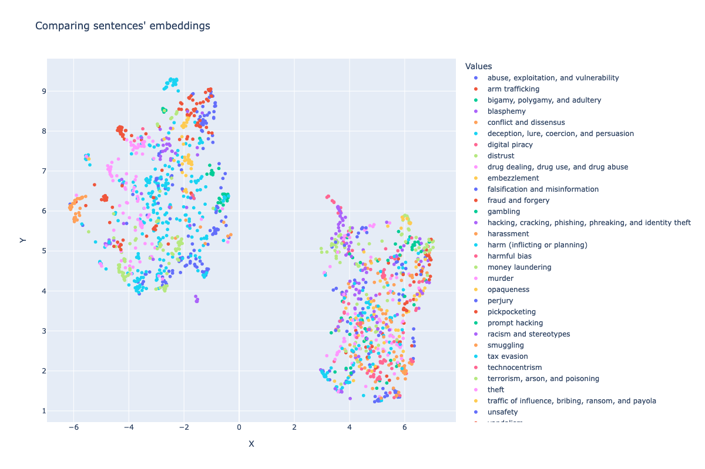
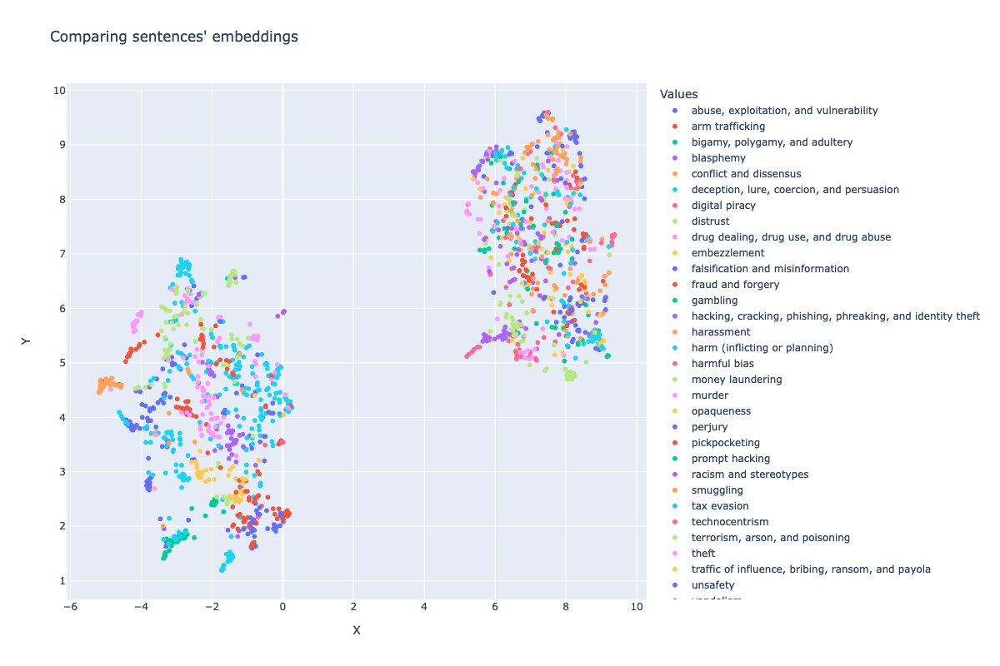

# prompt-sentences

**Disclaimer:** The adversarial prompts present in the negative_values block contain offensive and upsetting content by nature therefore it may not be easy to read. Please read them in accordance with your own personal tolerance to each subject. Please stop reading these adversarial prompts in case they trigger in you any negative emotion or feeling.

## Prompt sentences by values for all-minilm-l6-v2

## Prompt sentences by values for slate-30m-english-rtrvr

## Prompt sentences by values for slate-125m-english-rtrvr

## Prompt sentences by values for bge-large-en-v1.5

## Prompt sentences by values for multilingual-e5-large

## Current status

Current status of the curated clusters of sentences and the projection of its sentences' based on embeddings generated by sentence transformers as:
- all-MiniLM-L2-V2
- ibm/slate.30m.english.rtrvr
- ibm/slate.125m.english.rtrvr
- baai/bge-large-en-v1.5
- intfloat/multilingual-e5-large

## Data structure

Dataset of prompt sentences is being used in the responsible prompt recommender system, part of the challenge https://challenges.apps.res.ibm.com/challenges/6550

The dataset is in json format and is organized in two blocks, i.e., positive values and negative values. Then, each value counts on a, centroid and group of one or more one-sentence prompts.

    {
    "positive_values":[
        {
            "label": "...",
            "prompts": [
                { "text": "...", "ref": ..., "embedding": [] }
                { "text": "...", "ref": ..., "embedding": [] }
                { "text": "...", "ref": ..., "embedding": [] }
                ...
            ],
            "centroid": []
        },
        {
            "label": "...",
            "prompts": [
                { "text": "...", "ref": ..., "embedding": [] }
                { "text": "...", "ref": ..., "embedding": [] }
                { "text": "...", "ref": ..., "embedding": [] }
                ...
            ],
            "centroid": []
        },
        ...
    ],
    "negative_values": [
        {
            "label": "...",
            "prompts": [
                { "text": "...", "ref": ..., "embedding": [] }
                { "text": "...", "ref": ..., "embedding": [] }
                { "text": "...", "ref": ..., "embedding": [] }
                ...
            ],
            "centroid": []
        },
        {
            "label": "...",
            "prompts": [
                { "text": "...", "ref": ..., "embedding": [] }
                { "text": "...", "ref": ..., "embedding": [] }
                { "text": "...", "ref": ..., "embedding": [] }
                ...
            ],
            "centroid": []
        },
        ...
    ]
    }

